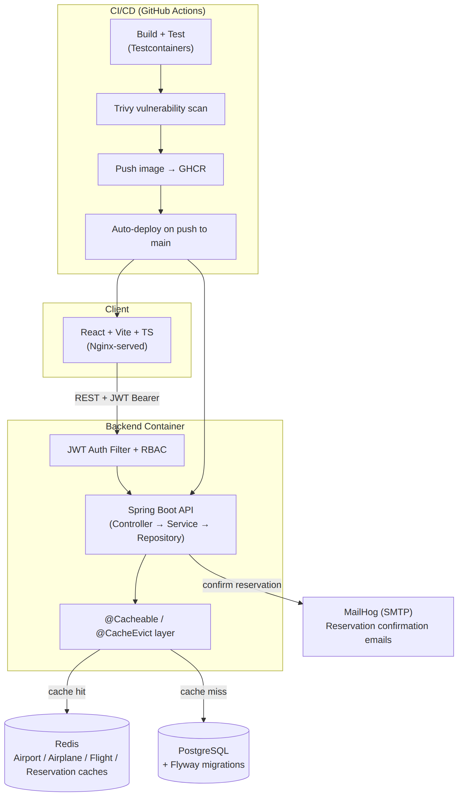
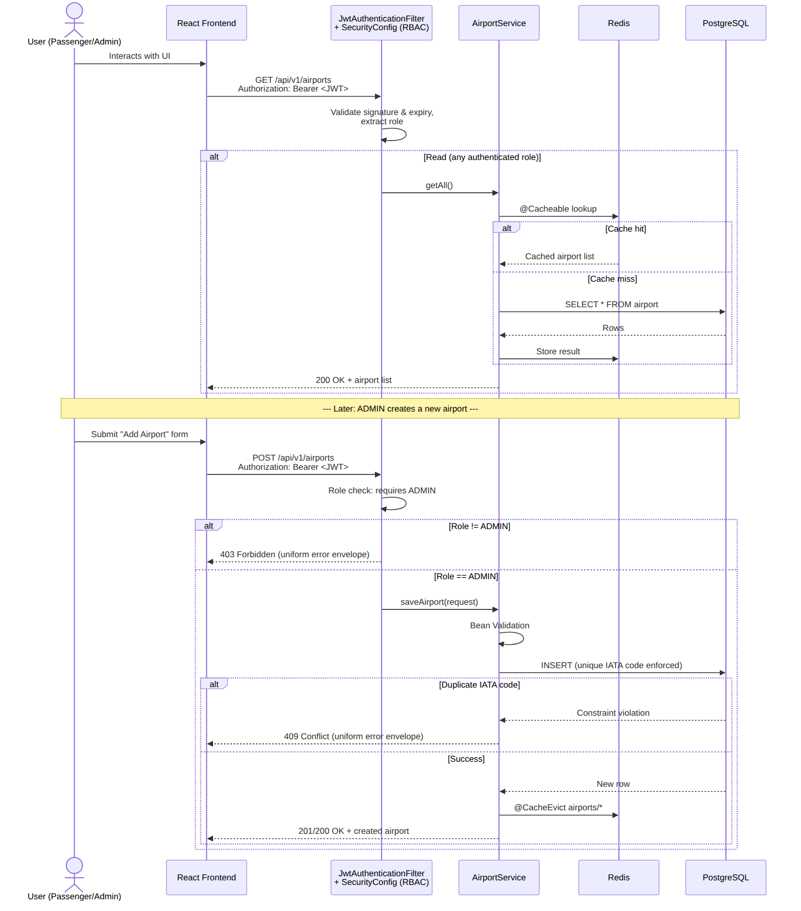
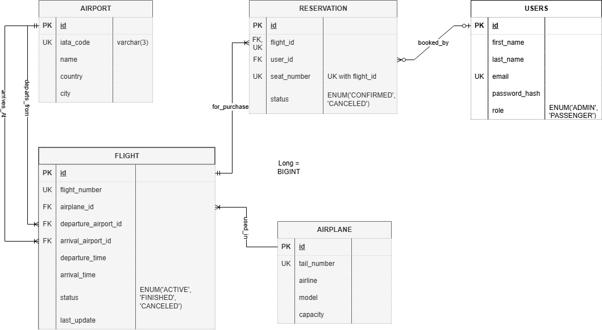
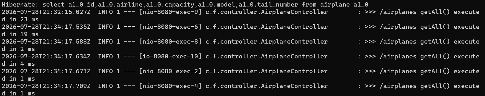
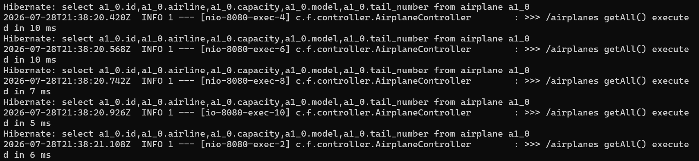
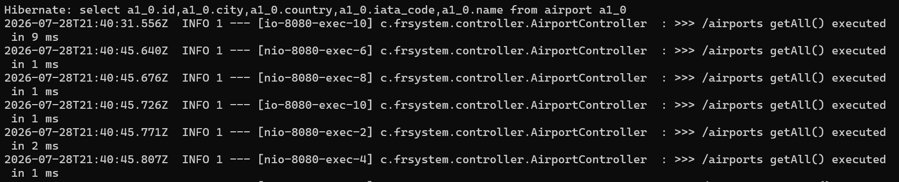
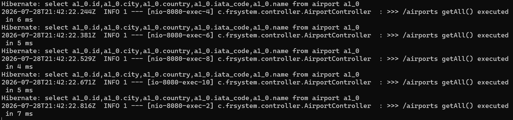

# Flight Reservation System

A full-stack flight reservation system: administrators manage airports, airplanes, and flights; passengers browse them and book seats. Built as a production-shaped internship project. Secured REST API, React frontend, and a Dockerized, CI/CD-driven delivery pipeline.

**Live demo:** [laudable-purpose-production-13f9.up.railway.app](https://laudable-purpose-production-13f9.up.railway.app)

---

## Tech Stack

| Layer | Technology | Role |
|---|---|---|
| **Backend** | Java 26 | Language runtime |
| | Spring Boot 4.1 | Application framework (Web MVC, Validation, Security) |
| | PostgreSQL | Primary relational database |
| | Spring Security + JWT (jjwt) | Stateless authentication & RBAC |
| | Redis (Spring Cache) | Listing/search/detail caching |
| | Flyway | Versioned, reproducible schema migrations |
| | Testcontainers | Integration tests against a real PostgreSQL instance |
| | springdoc-openapi (Swagger UI) | Interactive, Bearer-auth-enabled API docs |
| | MapStruct + Lombok | Entity ↔ DTO mapping, boilerplate reduction |
| | Spring Boot Actuator | Health checks (`/actuator/health`) |
| | Maven | Build tool |
| **Frontend** | React 18 + TypeScript | UI library / type safety |
| | Vite | Dev server & build tool |
| | React Router | Client-side routing, incl. protected/role-aware routes |
| | Tailwind CSS | Styling |
| | Axios | HTTP client (Bearer token attached per request) |
| | React Toastify | User-facing notifications/errors |
| **DevOps** | Docker + Docker Compose | Local/prod parity, single-command startup |
| | GitHub Actions | CI (build, test, lint) and CD |
| | Trivy | Container image vulnerability scanning |
| | GitHub Container Registry (GHCR) | Versioned image storage |
| | Railway | Live hosting, auto-deploys from `main` |
| | MailHog | SMTP catcher for reservation confirmation emails (dev) |


---

## Architecture




---

## Request Flow

**Example: a passenger requests `GET /api/v1/airports`, then an admin creates a new airport.**




**In short:** the frontend never talks to Redis or PostgreSQL directly, every request goes through the JWT filter and role check first. Reads are served from Redis when possible and only fall through to PostgreSQL on a cache miss; writes always hit PostgreSQL and then evict the relevant cache entries so nothing stale is ever returned afterward. Flyway owns every schema change, so the database is reproducible from a clean clone regardless of environment.

---

## Entity-Relationship Diagram



Matches the Flyway migration history exactly (`V1__airport_and_airplane_tables.sql` → `V5__create_reservations_table.sql`): the `(flight_id, seat_number)` unique constraint on `RESERVATION` is what enforces "no double-booking the same seat on the same flight" at the database level.

---

## Domain Model

- **Airport** — name, IATA code (unique), city, country. Full CRUD (ADMIN only for writes).
- **Airplane** — model, tail number (unique), capacity, airline. Full CRUD (ADMIN only for writes).
- **Flight** — flight number (unique), airplane, departure/arrival airport, departure/arrival time, status. Managed by ADMIN; browsable by everyone.
- **Reservation** — links a user, a flight, and a seat number, plus a status (`CONFIRMED` / `CANCELLED`). A **unique constraint on `(flight_id, seat_number)`** enforces "no double-booking the same seat on the same flight" at the database level. Cancelling is a soft delete; the row stays, only the status changes. Confirming a reservation sends an email via MailHog.

---

## Access Rules (RBAC)

| Action | ADMIN | PASSENGER |
|---|:---:|:---:|
| View airports / airplanes / flights | ✅ | ✅ |
| Create / update / delete airports, airplanes, flights | ✅ | ❌ |
| Create a reservation | ✅(self only) | ✅ (self only) |
| View own reservations (`/reservations/me`) | ✅ | ✅ |
| View **all** reservations / cancel **any** reservation | ✅ | ❌ |

Roles are enforced in `SecurityConfig` on the backend. The frontend hides admin-only UI as a convenience, but every write endpoint is gated server-side regardless of what the client sends.

---

## API Overview

Interactive documentation (Bearer auth supported directly in the UI) is available at:

```
/swagger-ui.html
```

| Group | Endpoint | Method | Access |
|---|---|---|---|
| **Auth** | `/api/v1/auth/register/passenger` | POST | Public |
| | `/api/v1/auth/register/admin` | POST | ADMIN |
| | `/api/v1/auth/login` | POST | Public |
| **Airports** | `/api/v1/airports` | GET / POST | Authenticated / ADMIN |
| | `/api/v1/airports/{id}` | GET / PUT / DELETE | Authenticated / ADMIN |
| | `/api/v1/airports/search` | POST | Authenticated |
| **Airplanes** | `/api/v1/airplanes` | GET / POST | Authenticated / ADMIN |
| | `/api/v1/airplanes/{id}` | GET / PUT / DELETE | Authenticated / ADMIN |
| | `/api/v1/airplanes/search` | POST | Authenticated |
| **Flights** | `/api/v1/flights` | GET / POST | Public / ADMIN |
| | `/api/v1/flights/{id}/status` | PUT | ADMIN |
| | `/api/v1/flights/{id}` | DELETE | ADMIN |
| | `/api/v1/flights/search` | POST | Public |
| **Reservations** | `/api/v1/reservations` | POST / GET | Authenticated / ADMIN |
| | `/api/v1/reservations/me` | GET | Authenticated |
| | `/api/v1/reservations/search` | GET | ADMIN |
| | `/api/v1/reservations/{id}/cancel` | PATCH | Authenticated (own) |
| | `/api/v1/reservations/{id}/admin-cancel` | PATCH | ADMIN |
| | `/api/v1/reservations/flight/{flightId}` | GET | Authenticated |

All error responses use a uniform shape:

```json
{
  "status": 409,
  "error": "exampleError",
  "message": "exampleMessage.",
  "timestamp": "2026-07-30T00:00:00.000Z"
}
```

---

## Getting Started

**Prerequisites:** Docker and Docker Compose.

```bash
git clone https://github.com/JesusOrderRise/flight-reservation-system.git
cd flight-reservation-system
cp .env.example .env   # then fill in the values below
docker compose -f docker-compose-all.yaml up
```

That single command brings up PostgreSQL, Redis, MailHog, pgAdmin, the backend, and the frontend, wired together with healthchecks.

| Service | Default URL |
|---|---|
| Frontend | `http://localhost:5173` |
| Backend API | `http://localhost:8080` |
| Swagger UI | `http://localhost:8080/swagger-ui.html` |
| MailHog (caught emails) | `http://localhost:8025` |
| pgAdmin | `http://localhost:1337` |

### Environment Variables

All variables are documented in `.env.example`:

| Variable | Purpose |
|---|---|
| `POSTGRES_DB`, `POSTGRES_USER`, `POSTGRES_PASSWORD`, `POSTGRES_PORT` | Database connection |
| `PGADMIN_DEFAULT_EMAIL`, `PGADMIN_DEFAULT_PASSWORD`, `PGADMIN_PORT` | pgAdmin login |
| `BACKEND_PORT`, `FRONTEND_PORT` | Exposed service ports |
| `JWT_SECRET`, `JWT_EXPIRATION` | Token signing key and expiry (ms). Generate a real random secret for anything beyond local dev |
| `MAILHOG_HOST`, `MAILHOG_SMTP_PORT`, `MAILHOG_WEB_PORT` | Local SMTP test server |
| `REDIS_HOST`, `REDIS_PORT`, `REDIS_USER`, `REDIS_PASSWORD`, `REDIS_TTL` | Cache connection and entry TTL (ms) |
| `VITE_API_URL`, `FRONTEND_URL` | Frontend → backend wiring |

Never commit a real `.env` file. Secrets are injected via GitHub Actions secrets and Railway's environment configuration in every non-local environment.

---

## Redis Caching

`@Cacheable` covers the airport, airplane, flight, and reservation listing/search/detail queries; `@CacheEvict` clears the relevant cache regions on every create, update, delete, or cancellation, so no stale data is ever served after a write. Reservation lookups for the current user are keyed off the authenticated principal so passengers never see each other's cached results.

### Benchmark: cache hit vs. cache miss

Measured locally against `GET /api/v1/airplanes` and `GET /api/v1/airports`, timed with a log statement wrapping each controller call. "Forced miss" clears the corresponding Redis key with `redis-cli DEL` before every request; "cache hit" lets Redis serve the previously-cached result.

**`GET /api/v1/airplanes`**

| Run | Forced miss (DB hit) | Cache hit |
|---|---:|---:|
| 1 | 10 ms | 19 ms* |
| 2 | 10 ms | 2 ms |
| 3 | 7 ms | 4 ms |
| 4 | 5 ms | 1 ms |
| 5 | 6 ms | 1 ms |
| **Average** | **7.6 ms** | **~2 ms** (excluding warm-up outlier*) |

**`GET /api/v1/airports`**

| Run | Forced miss (DB hit) | Cache hit |
|---|---:|---:|
| 1 | 6 ms | 1 ms |
| 2 | 5 ms | 1 ms |
| 3 | 4 ms | 1 ms |
| 4 | 5 ms | 2 ms |
| 5 | 7 ms | 1 ms |
| **Average** | **5.4 ms** | **1.2 ms** |

\* The first request in the airplane cache-hit run measured 19 ms, well above the rest of the series (1–4 ms), likely a kind off JIT/connection warm-up rather than a real cache miss, since only a single `SELECT` was logged for the whole run. Excluded from the average for that reason.

Even on this small local dataset, Redis consistently cuts response time by roughly **70–85%** for these listing endpoints; the gap will widen further as the underlying tables grow.

---

## Testing

- **Unit tests** for every service (`AirportServiceTest`, `AirplaneServiceTest`, `FlightServiceTest`, `ReservationServiceTest`, `AuthServiceTest`, `EmailServiceTest`) and repository layer.
- **Integration tests** (Testcontainers + real PostgreSQL) covering the full auth flow, the reservation lifecycle (create → confirm → cancel, including the double-booking conflict), and RBAC enforcement end to end (`EndToEndIntegrationTest`).
- Tests run automatically in CI; a failing test blocks the build (and therefore the image push).

Run locally:

```bash
cd frsystem-backend
./mvnw clean verify
```

---

## CI/CD Pipeline

On every push/PR to `main`:

1. **Backend:** build with Maven, run the full test suite (including Testcontainers).
2. **Frontend:** `npm ci`, lint (fails the build on lint errors), production build.
3. **Security:** build both Docker images and scan them with **Trivy**; the pipeline fails on any unfixed CRITICAL/HIGH vulnerability.
4. **Publish:** on merge to `main`, push versioned, SHA-tagged images for backend and frontend to **GitHub Container Registry**.
5. **Deploy:** Railway is connected to the `main` branch and redeploys automatically on every push that passes the pipeline above, giving a live URL with no manual steps.

Secrets (JWT signing key, DB credentials, SMTP, Redis) are injected via GitHub Actions secrets and Railway's environment variables, nothing is baked into the images or committed to the repo.

---

## Known Limitations / Roadmap

An items from the original scope were consciously deferred to ship a working, tested, deployed system within the internship timeline:

- **Frontend data/forms:** TanStack Query and react-hook-form + zod were planned but not yet integrated; the frontend currently uses Axios directly with component state and native form handling.

Everything else in the original project brief: JWT auth, RBAC, Bean Validation with the uniform error envelope, Flyway migrations, Redis caching with a documented invalidation strategy and benchmark, Testcontainers integration tests, Swagger/OpenAPI, the React frontend, Docker Compose, and the full CI/CD pipeline through to a live deploy, is in place.

---

## Benchmark Proof (Raw Terminal Output)

Screenshots of the actual local runs behind the [Redis benchmark table](#redis-caching) above. Five requests to each endpoint, first with Redis serving the cached result, then with the corresponding cache key forcibly cleared (`redis-cli DEL`) before every call so PostgreSQL has to be hit each time.

**`GET /api/v1/airplanes`**

| Cache hit | Forced cache miss |
|---|---|
|  |  |

**`GET /api/v1/airports`**

| Cache hit | Forced cache miss |
|---|---|
|  |  |

In the "forced miss" screenshots, note the `Hibernate: select ...` line logged before every single request, proof of PostgreSQL is genuinely being hit each time rather than Redis silently absorbing the load.